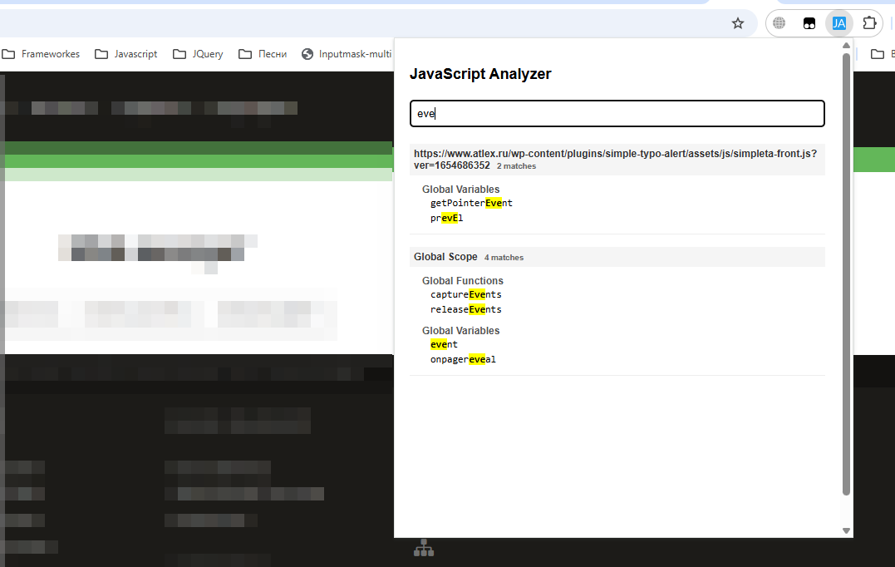

# JavaScript Analyzer - Chrome Extension

## Описание
JavaScript Analyzer - это расширение для Chrome, которое анализирует все JavaScript файлы на текущей странице, включая:

- Внешние скрипты
- Встроенные скрипты
- Глобальные объекты и функции

Расширение предоставляет удобный интерфейс для просмотра всех классов, методов, свойств, глобальных функций, переменных и констант, найденных на странице.

## Основные возможности
📂 Список всех JavaScript файлов на странице

🔍 Поиск по файлам, функциям и переменным

🏷 Просмотр всех классов и их методов

🌐 Анализ глобальной области видимости (window)

🔦 Подсветка совпадений при поиске

📊 Счетчик совпадений для каждого файла

## Установка
- Скачайте или клонируйте репозиторий
- Откройте Chrome и перейдите на страницу chrome://extensions/
- Включите режим разработчика (переключатель в правом верхнем углу)
- Нажмите "Загрузить распакованное расширение"
- Выберите папку с расширением

## Использование
- Нажмите на иконку расширения в панели инструментов Chrome
- Дождитесь завершения анализа (обычно несколько секунд)
- Используйте поле поиска для быстрого нахождения нужных элементов
- Нажимайте на заголовки файлов для развертывания/свертывания списка элементов 
## Ограничения
- Некоторые скрипты могут быть недоступны из-за политики CORS
- Анализ основан на регулярных выражениях, поэтому возможны неточности
- Динамически загружаемые скрипты не анализируются автоматически
## Планы по развитию
- Интеграция с полноценным парсером JavaScript
- Поддержка динамически загружаемых скриптов
- Отображение строк, где найдены элементы
- Подсветка синтаксиса
- Экспорт результатов анализа

## Разработчикам
Расширение использует:

- Manifest V3
- Chrome API для анализа контента
- Чистый JavaScript без зависимостей

Для улучшения анализатора можно заменить текущую реализацию на основе регулярных выражений на полноценный парсер JavaScript (например, Acorn или Esprima).

## Лицензия
MIT License